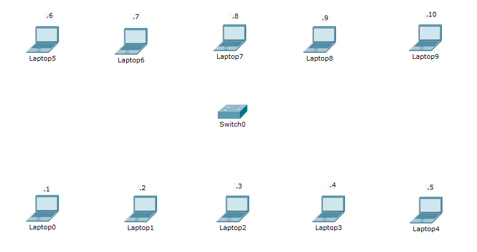
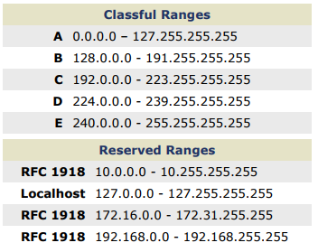

# Empty Switch

Exercice sur la comprehension d'un mini reseau local

A l'aide des classes d'addresses IP construisez un reseau local vous permettant de vous connecter ensemble:

Instructions:

* Choisissez une classe d'adressage commune (i.e. A, B ou C)

* configurer l'adresse IP de votre PC (prendre l'adressage statique)

* construisez votre cable (patch calble RJ45)

* cabler votre PC a l'equipement de reseau

* appellez l'equipement d'un de vos camarades (i.e. ping)

## Sources:

[IPv4 Subnetting](http://packetlife.net/media/library/15/IPv4_Subnetting.pdf) IPv4 Cheat Sheet

