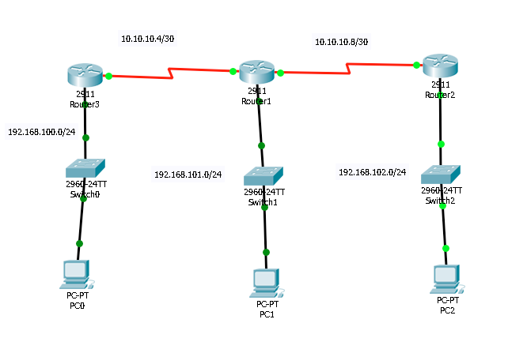

# Amelie

## Schema

## Connectivite

| Reseau:             |  Passerelle | Commentaires (i.e. ping 192.168.100.254)|
|---------------------|-------------|-----------------------------------------| 
| 192.168.100`.0`/24  | [Ping]      | `Adresse reseau incomplete dans la note`|
| 192.168.101.0/24    | [Ping]      |                                         |
| 192.168.102.0/24    | [Ping]      |                                         |

| Reseau:             |  Routeur    | Commentaires (i.e. ping 10.10.10.5 )    |
|---------------------|-------------|-----------------------------------------| 
| 192.168.100.0/24    | [Ping]      | .5                                      |
| 192.168.101.0/24    | [Ping]      | .6                                      |
| 192.168.101.0/24    | [Ping]      | .9                                      |
| 192.168.102.0/24    | [Ping]      | .10                                     |

| Reseau:             |  Routeur    | Commentaires (i.e. ping 10.10.10.5 )    |
|---------------------|-------------|-----------------------------------------| 
| 10.10.10.4/30       | [Ping]      | .5 => .6  `Adresse reseau manquant`     |
| 10.10.10.4/30       | [Ping]      | .6 => .9                                |
| 10.10.10.8/30       | [Ping]      | .9 => .10 `Adresse reseau manquant`     |

