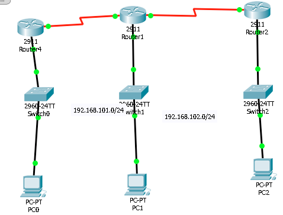

Bonjour,

## Schema

## Connectivite

| Reseau:             |  Passerelle | Commentaires (i.e. ping 192.168.100.254)|
|---------------------|-------------|-----------------------------------------| 
| 192.168.100.0/24    | [Ping]      | `Adresse reseau manquant dans la note`  |
| 192.168.101.0/24    | [Ping]      |                                         |
| 192.168.102.0/24    | [Ping]      |                                         |

| Reseau:             |  Routeur    | Commentaires (i.e. ping 10.10.10.5 )    |
|---------------------|-------------|-----------------------------------------| 
| 192.168.100.0/24    | [None]      | .5  `Passerelle non connectee`          |
| 192.168.101.0/24    | [None]      | .6  `Passerelle non connectee`          |
| 192.168.101.0/24    | [None]      | .9  `Passerelle non connectee`          |
| 192.168.102.0/24    | [None]      | .10  `Passerelle non connectee`         |

| Reseau:             |  Routeur    | Commentaires (i.e. ping 10.10.10.5 )    |
|---------------------|-------------|-----------------------------------------| 
| 10.10.10.4/30       | [Ping]      |    => .6  `Adresse reseau manquant`     |
| 10.10.10.4/30       | [Ping]      | .5 => .10                               |
| 10.10.10.8/30       | [Ping]      |    => .9  `Adresse reseau manquant`     |
